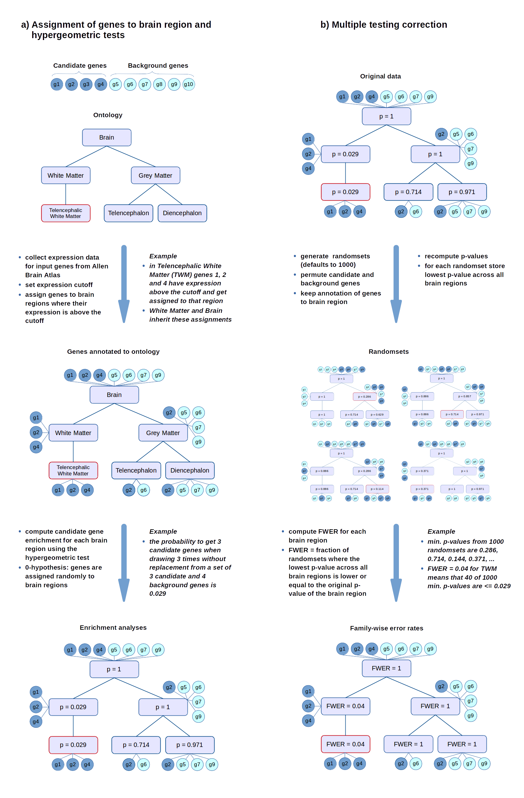
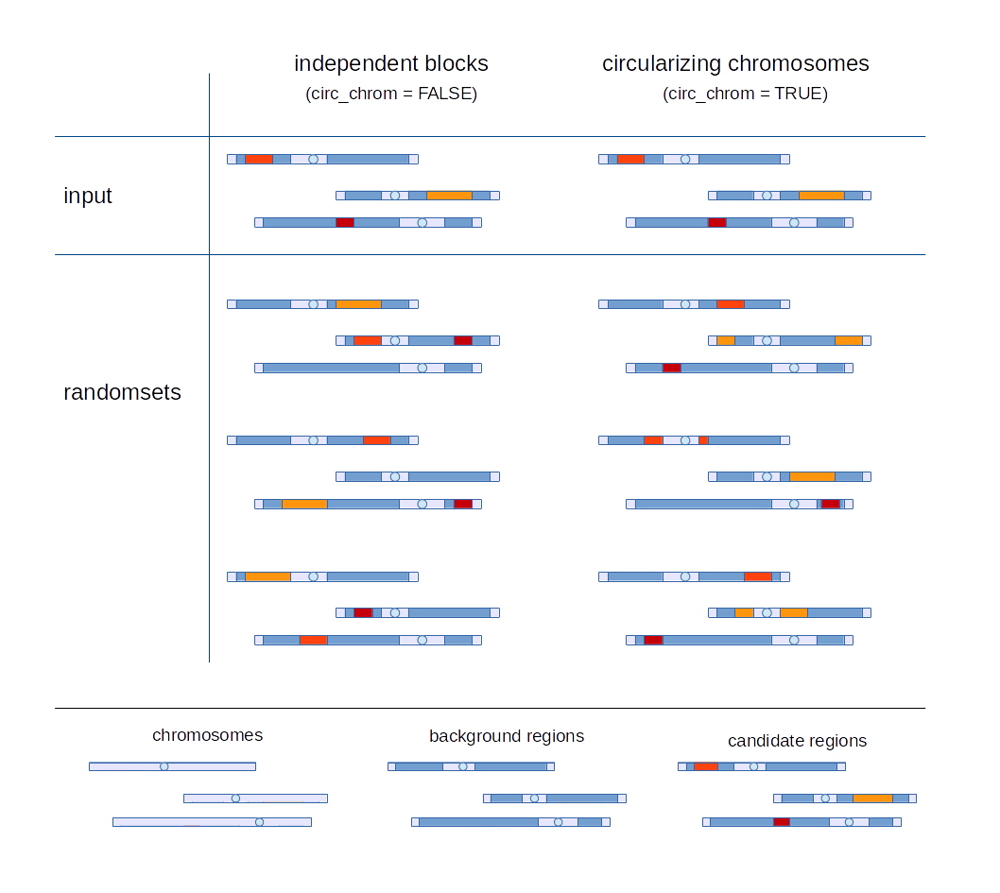

```{r style, echo = FALSE, results = 'asis'}
BiocStyle::markdown()
```
```{r global_options, include=FALSE}
knitr::opts_chunk$set(fig.width=10, fig.height=7, warning=FALSE, message=FALSE)
options(width=110)
set.seed(123)
```

<!--
%\VignetteIndexEntry{ABAEnrichment: gene expression enrichment in human brain regions}
%\VignetteEngine{knitr::knitr}
-->

# ABAEnrichment: Gene Expression Enrichment in Human Brain Regions

Package: ABAEnrichment   
Author: Steffi Grote   
Date: October 14, 2016   

## Overview
`r Biocpkg("ABAEnrichment")` is an R package for the enrichment analysis of user defined candidate genes (in the set of expressed protein coding genes) in different human brain regions. The package integrates the expression of the candidate gene set (averaged across donors) and the structural information of the brain using an ontology, both provided by the Allen Brain Atlas project [1-4]. The statistical analysis is performed by the core function `aba_enrich` which interfaces the ontology enrichment software FUNC [5]. Additional functions provided in this package are `get_expression`, `plot_expression`, `get_name`, `get_sampled_substructures` and `get_superstructures` supporting the exploration and visualization of the expression data. 

The enrichment analysis for candidate genes is performed by using either the hypergeometric or the Wilcoxon rank test implemented in the ontology enrichment software FUNC [5]. The hypergeometric test evaluates the enrichment of expressed candidate genes compared to a set of background genes for each brain region. The background genes can be defined explicitly like the candidate genes or, by default, consist of all expressed genes from the dataset outside the candidate genes. Using the Wilcoxon rank test, scores assigned to candidate genes are tested for an enrichment in brain regions. The boundary between 'expressed' and 'not expressed' is defined by different expression quantiles (e.g. the lowest 40% of gene expression are 'not expressed' and the upper 60% are 'expressed' for a quantile of 0.4). These cutoffs are set with the parameter `cutoff_quantiles` and an analysis is run for every cutoff separately. 

To account for multiple testing FUNC uses random permutations of scores assigned to genes for the Wilcoxon rank test. For the hypergeometric test candidate and background genes are permuted (see [Schematic 1](#hyper_scheme) below). This is also the default behaviour in `r Biocpkg("ABAEnrichment")`. In addition, `r Biocpkg("ABAEnrichment")` provides the option to condition the chance of a background gene to be selected as a random candidate gene on the length of the background gene (option `gene_len`).  
Furthermore, whole genomic regions can be provided as input instead of defining genes explicitly. `r Biocpkg("ABAEnrichment")` then tests the expressed genes in the candidate regions for enrichment in brain regions compared to the expressed genes in the background regions. The randomsets then also consist of randomly chosen candidate regions inside the background regions, either as a whole block in one background region (default), or on the same chromosome allowing to overlap multiple background regions on that chromosome (option `circ_chrom`, see [Schematic 2](#block_scheme) below).

The package incorporates three different brain expression datasets: first, microarray data from adult individuals, second, RNA-seq data from individuals of five different developmental stages (prenatal, infant, child, adolescent, adult) and third, a developmental effect score measuring the age effect on expression for given genes. In the latter case the data are not divided into 'expressed' and 'not expressed', but into 'developmental effect score above cutoff' or not. However, for simplicity we only refer to 'expression' in that documentation. For details on the datasets see the `r Biocexptpkg("ABAData")` vignette.


Overview of the functions included in ABAEnrichment:

function | description
-------- | ----------
`aba_enrich` | core function for performing enrichment analyses given a candidate gene set.
`get_expression` | returns expression data or developmental effect scores for a given set of genes and brain structures.
`plot_expression` | plots a heatmap with expression data or developmental effect scores for a given set of genes and brain structures.
`get_name` | returns the full name of a brain region given a structure id.
`get_sampled_substructures` | returns the substructures of a given brain region that have expression data available.
`get_superstructures` | returns the superstructures of a given brain region.


## Examples   

### Test gene expression enrichment with hypergeometric test
For a random set of 13 genes a test for expression enrichment in human brain regions for different developmental stages is performed. A binary vector with '1' for a candidate gene and '0' for a background gene and names as gene identifiers (Entrez-ID, Ensembl-ID or HGNC-symbol) needs to be defined. In this example no background genes are defined, in which case all remaining protein coding genes of the dataset are used as background.

```{r} 
## load ABAEnrichment package
require(ABAEnrichment)
## create input vector with candidate genes 
genes = rep(1,13)
names(genes) = c('NCAPG', 'APOL4', 'NGFR', 'NXPH4', 'C21orf59', 'CACNG2', 'AGTR1', 'ANO1', 'BTBD3', 'MTUS1', 'CALB1', 'GYG1', 'PAX2')
genes
```
In order to test the 13 random genes for enrichment in brain regions at different developmental stages using `aba_enrich` the following parameters have to be defined: the vector 'genes' and the dataset '5\_stages'. Additionally, in this example two optional parameters are set: the `cutoff_quantiles` 0.5, 0.7 and 0.9 for an example of using the 50%, 70% and 90% expression quantile across all genes as the boundary between 'expressed' and 'not expressed' genes and `n_randsets` 100 to use 100 random permutations to calculate the FWER. `cutoff_quantiles` and `n_randsets` have default values seq(0.1,0.9,0.1) and '1000' respectively. The values in the examples are reduced to lower the computation time. 

```{r,results='hide'} 
## run enrichment analysis
res = aba_enrich(genes,dataset='5_stages', cutoff_quantiles=c(0.5,0.7,0.9), n_randsets=100)
```


The function `aba_enrich` returns a list, the first element of which contains the results of the statistical analysis for each brain region and age category, since for the '5_stages' dataset the analyses are performed independently for each developmental stage:

```{r}
## extract first element from the output list, which contains the statistics
fwers = res[[1]]
## see results for the brain regions with highest enrichment for children (3-11 yrs, age_category 3)
head(fwers[fwers[,1]==3,])
```

The rows in the output data frame are ordered by `age_category`, `times_FWER_under_0.05`, `mean_FWER` and `min_FWER`; with `min_FWER` for example denoting the minimum FWER for expression enrichment of the candidate genes in this brain region across all expression cutoffs. The column `FWERs` lists the individual FWERs for each cutoff. The column `equivalent_structures` lists structures with identical expression data due to lack of independent expression measurements in all regions. Nodes (brain regions) in the ontology inherit data from their children (substructures), and in the case of only one child node with expression data, the parent node inherits the childs' data leading to identical enrichment statistics .

In addition to the statistics, the list that is returned from `aba_enrich` also contains the input genes for which expression data is available and for each age category the gene expression values that correspond to the requested `cutoff_quantiles`:

```{r}
res[2:3]
```

#### Choose random candidate regions dependent on gene length
The default behaviour of `aba_enrich` is to permute candidate and background regions randomly to compute the FWER. With the option `gene_len=TRUE`, random selection of background genes as candidate genes is dependent on the gene length, i.e. a gene twice as long as another gene also is twice as likely selected as a candidate gene in a randomset.

```{r,eval=FALSE} 
## run enrichment analysis, with randomsets dependent on gene length
aba_enrich(genes, gene_len = TRUE)
```

### Test gene expression enrichment for genomic regions
Instead of defining candindate and background genes explicitly in the `genes` input vector, it is also possible to define entire chromosomal regions as candidate and background regions. The expression enrichment is then tested for all protein coding genes located in or overlapping the candidate region on the plus or the minus strand. The gene coordinates used to identify those genes were obtained from [http://grch37.ensembl.org/biomart/martview/]. For the random permutations used to compute the FWER, blocks as long as candidate regions are chosen from the background regions and genes contained in these blocks are considered candidate genes ([Schematic 2](#block_scheme)).  
To define chromosomal regions in the input vector, the names of the 1/0 vector have to be of the form `chr:start-stop`, where `start` always has to be smaller than `stop`. Note that this option requires the input of background regions. If multiple candidate regions are provided, in the randomsets they are placed randomly, but non-overlapping into the background regions. The output of `aba_enrich` is identical to the one that is produced for single genes. The second element of the output list contains the candidate and background genes located in the user defined regions:

```{r} 
## create input vector with a candidate region on chromosome 8
## and background regions on chromosome 7, 8 and 9
genes = c(1, rep(0,6))
names(genes) = c('8:82000000-83000000', '7:1300000-56800000', '7:74900000-148700000','8:7400000-44300000', '8:47600000-146300000', '9:0-39200000', '9:69700000-140200000')
genes
```
```{r,results='hide'} 
## run enrichment analysis for the adult human brain
res = aba_enrich(genes, dataset='adult', cutoff_quantiles=c(0.5,0.7,0.9), n_randsets=100)
```
```{r}
## look at the results from the enrichment analysis
fwers = res[[1]]
head(fwers)
## see which genes are located in the candidate regions
input_genes = res[[2]]
candidate_genes = input_genes[input_genes==1]
candidate_genes
```

An alternative method to choose random blocks from the background regions can be used with the option `circ_chrom=TRUE`. Every candidate region is then compared to background regions on the same chromosome ([Schematic 2](#block_scheme)). And in contrast to the default `circ_chrom=FALSE`, randomly chosen blocks do not have to be located inside a single background region, but are allowed to overlap multiple background regions. This means that a randomly chose block can consist of the end of the last background region and the beginning of the first background region on a given chromosome.


```{r} 
## create input vector with a candidate region on chromosome 8
## and background regions on chromosome 8
genes = c(1,0,0)
names(genes) = c('8:82000000-82700000', '8:7400000-44300000', '8:47600000-146300000')
genes
```
```{r,results='hide'} 
## run enrichment analysis for the 5 developmental stages using the "circ_chrom" option
res = aba_enrich(genes, dataset='5_stages', cutoff_quantiles=c(0.5,0.7,0.9), n_randsets=100, circ_chrom=TRUE)
```
```{r}
## look at the results from the enrichment analysis for children (age_category 3)
fwers = res[[1]]
head(fwers[fwers$age_category==3,])
```

### Explore expression data
#### Explore data from the last expression analysis

The function `get_expression` enables the output of gene and brain region specific expression data averaged across donors. By only setting the parameter `structure_ids` defining the brain regions, the `gene_ids` and `dataset` are automatically set to the genes and dataset used in the last enrichment analysis. 
In comparison to defining genes and brain regions explicitly this saves some time since some pre compuations on the original dataset, e.g. aggregation of expression per gene do not have to be redone. 
By setting the parameter `background` to `TRUE`, the gene expression data for both candidate genes and background genes is returned. For the '5\_stages' `dataset` the output of `get_expression` is a list with a data.frame for each developmental stages, where the first element corresponds to the first stage and so on:

```{r}
## get expression data (list) for the first 5 brain structures of the enrichment analysis output
expr = get_expression(fwers[1:5,"structure_id"], background=FALSE)
## look at the structure of the expression data
str(expr)
## see expression for children (age_category 3 -> 3rd element of expression list)
head(expr[[3]])
```

The function `plot_expression` enables the visualization of expression data. The input parameters of `plot_expression` are identical to those of `get_expression` except for the additional arguments `dendro` and `age_category` which determine whether or not a dendrogram should be added to the heatplot and the developmental stage to be plotted, respectively.


```{r}
## plot expression in 5 structures with dendrogram for the prenatal stage (age_category 1)
plot_expression(fwers[1:5,"structure_id"], age_category=1)
```
The colored side bar in the plot without dendrogram colors candidate genes (red) and background genes (black) independently. In this case only candidate gene expression was plotted (with the default option `background=FALSE`):

```{r}
## plot expression for the 10 highest scoring brain structures in age category 3 (children, 3-11 yrs) without dendrogram
plot_expression(fwers[fwers$age_category==3, 'structure_id'][1:10], dendro=FALSE, age_category=3)
```

#### Explore data independently from enrichment analysis

Both `get_expression` and `plot_expression` can also be used independently from a previous statistical analysis with `aba_enrich`. In this case the `gene_ids` and the `dataset` must be specified. `gene_ids` again can be Entrez-ID, Ensembl-ID or HGNC-symbol. For example: obtaining and visualizing the expression of a specific set of genes in the *precentral gyrus*, which corresponds to the structure id 'Allen:4010', is accomplished by:
```{r}
## get expression data for six genes in the brain structure 'Allen:4010' 
get_expression(structure_ids=c('Allen:4010'), gene_ids=c(324,8312,673,1029,64764,1499), dataset='adult')
## plot this expression 
plot_expression(structure_ids=c('Allen:4010'), gene_ids=c(324,8312,673,1029,64764,1499), dataset='adult')
```

In this example the structure 'Allen:4010' does not directly have independet expression data available in the data set, but some of its substructures do have. Plotting or requesting expression data for 'Allen:4010' automatically obtains the data for all its substructures. The function `get_sampled_substructures` returns all the substructures for which expression data is available. The function `get_name` is useful to see the name of a brain region that corresponds to a structure id:
```{r}
## get ids of the substructres of 'Allen:4010' that have expression data annotated
subs = get_sampled_substructures('Allen:4010')
## get the full name of those substructures
get_name(subs)
```

Besides the function `get_sampled_substructures` the package also contains a function `get_superstructures` which returns all superstructures of the requested structure and the structure itself. The output is ordered according to the hierarchy of brain structures beginning with the top structure: 

```{r}
## get ids of the superstructures of 'Allen:4010'
supers = get_superstructures('Allen:4010')
## get the full name of those superstructures
get_name(supers)
```


### Test gene expression enrichment with Wilcoxon rank test

The Wilcoxon rank test requires a score for given sets of genes. It then evaluates the ranks of the genes (based on their score) that are expressed in a given brain structure compared to all the candidate genes that are expressed anywhere in the brain. Again, the `genes` vector defines the scores, ranking the genes on specific features, while the names of the vector are the corresponding gene identifiers:

```{r}
## create input vector with random scores associated with the candidate genes
genes = sample(1:50, 12)
names(genes) = c('ENSG00000168036', 'ENSG00000157764', 'ENSG00000163041', 'ENSG00000182158', 'ENSG00000147889', 'ENSG00000103126', 'ENSG00000182054', 'ENSG00000184634', 'ENSG00000134982', 'ENSG00000138413', 'ENSG00000133703', 'ENSG00000132475')
genes
```
```{r,results='hide'} 
## run enrichment analysis
res = aba_enrich(genes, dataset='adult', test='wilcoxon', cutoff_quantiles=c(0.2,0.5,0.8), n_randsets=100)
```
```{r}
## see the 5 brain regions with the lowest FWERs
res[[1]][1:5,]
```

Plotting the expression for the output brain regions with the option `dendro=FALSE` results in a side bar with genes and its scores that were used for the initial enrichment test:

```{r}
## plot expression of the 5 brain strcutures with the lowest FWERs, with genes ordered by user defined score from Wilcoxon rank test
plot_expression(res[[1]][1:5,"structure_id"], dendro=FALSE)
```


### Test developmental effect enrichment with Wilcoxon rank test
In the previous examples genes got annotated to brain regions based on their expression. Besides the two gene expression datasets 'adult' and '5\_stages', the dataset 'dev\_effect' can be used, which provides scores for an age effect for genes based on their expression change during development. Using this dataset the same analyses as above are performed, except that a gene is annotated to a brain region when its developmental effect score in that region is a above the `cutoff_quantiles`.  
To test the same genes and scores as used above for enrichment of high scoring genes in the set of all genes with a developmental effect score above cutoff, the `dataset` parameter has to be set to 'dev_effect': 

```{r,results='hide'} 
## run enrichment analysis with developmental effect score
res = aba_enrich(genes, dataset='dev_effect', test='wilcoxon', cutoff_quantiles=c(0.2,0.5,0.8), n_randsets=100)
```

The output of the developmental effect enrichment analysis is equal to that of the expression enrichment analysis:

```{r}
## see the 5 brain regions with the lowest FWERs
res[[1]][1:5,]
```

Again, the developmental effect scores can be retrieved with the functions `get_expression` and plotted with `plot_expression`:
```{r}
## plot developmental effect score of the 5 brain strcutures with the lowest FWERs
plot_expression(res[[1]][1:5,"structure_id"])
```


## Schematics

#### <a name="hyper_scheme"></a>Schematic 1: Hypergeometric test and the FWER calculation



The FWER for the Wilcoxon rank test is computed in a similar way, with random permutations of the scores that are assigned to genes.

#### <a name="block_scheme"></a>Schematic 2: `circ_chrom` option for genomic regions input



To use genomic regions as input, the names of the `genes` input vector have to be of the form `chr:start-stop`. The option `circ_chrom` defines how candidate regions are randomly moved inside the background regions for computing the FWER. When `circ_chrom = FALSE` (default), candidate regions can be moved to any background region on any chromosome, but are not allowed to overlap multiple background regions. When `circ_chrom = TRUE`, candidate regions are only moved on the same chromosome and are allowed to overlap multiple background regions. The chromosome is "circularized", that is a randomly placed candidate region may start at the end of the chromosome and continue on the the beginning.

## Session Info
```{r}
sessionInfo()
```

## References

[1] Hawrylycz, M.J. et al. (2012) An anatomically comprehensive atlas of the adult human brain transcriptome, Nature 489: 391-399. [doi:10.1038/nature11405]

[2] Miller, J.A. et al. (2014) Transcriptional landscape of the prenatal human brain, Nature 508: 199-206. [doi:10.1038/nature13185]

[3] Allen Institute for Brain Science. Allen Human Brain Atlas (Internet). Available from:
[http://human.brain-map.org/]

[4] Allen Institute for Brain Science. BrainSpan Atlas of the Developing Human Brain
(Internet). Available from: [http://brainspan.org/]

[5] Pruefer, K. et al. (2007) FUNC: A package for detecting significant associations between gene
sets and ontological annotations, BMC Bioinformatics 8: 41. [doi:10.1186/1471-2105-8-41]
